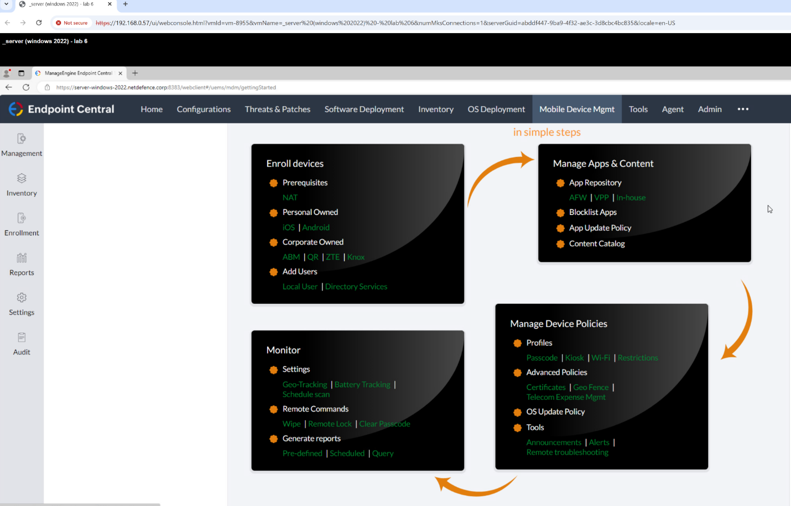
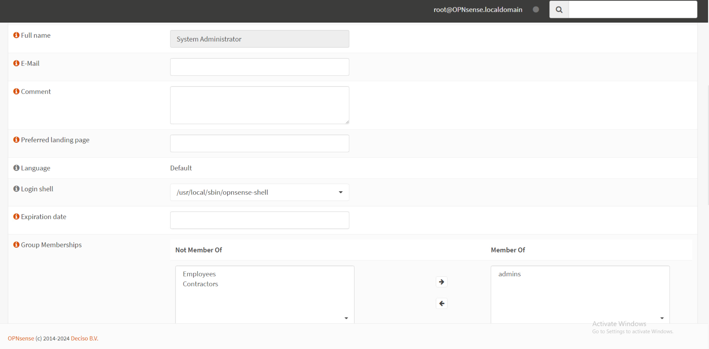

# Network Defense (Fall 2024) — Weekly Portfolio

A formal, week-by-week record of what I built and learned in **CSC-7303 Network Defense** (Cambrian College, Ontario). Written for hiring managers and technical peers, with inline evidence and full scripts.

<p align="center">
  
  
</p>

<p align="center"><em>Left: ManageEngine Endpoint Central — MDM enrollment & policy lifecycle &nbsp; · &nbsp; Right: OPNsense User Manager — administrator role and group memberships</em></p>

> Screenshots live in `./screenshots/`. Scripts live in `./scripts/` and are embedded in **Appendix A** below.

## Start Here

- [Midterm Project Summary](MIDTERM_PROJECT_SUMMARY.md)
- [Final Exam — Vulnerability Assessment](FINAL_EXAM_VULNERABILITY_ASSESSMENT.md)
- [Evidence & Screenshots Index](EVIDENCE_INDEX.md)
- [Scripts Overview](SCRIPTS_README.md)

---

## Table of Contents

- [Week 1 — Lab Environment Setup & Network Fundamentals](#week-1--lab-environment-setup--network-fundamentals)
- [Week 2 — Active Directory & Domain Join](#week-2--active-directory--domain-join)
- [Week 3 — Perimeter & Host Firewall Policies](#week-3--perimeter--host-firewall-policies)
- [Week 4 — Linux Hardening (Ubuntu/CentOS)](#week-4--linux-hardening-ubuntucentos)
- [Week 5 — Data-at-Rest Protection](#week-5--data-at-rest-protection)
- [Week 6 — Vulnerability Assessment (Nessus + Nmap)](#week-6--vulnerability-assessment-nessus--nmap)
- [Week 7 — Ubuntu Remediation via Automation](#week-7--ubuntu-remediation-via-automation)
- [Week 8 — CentOS Remediation via Automation](#week-8--centos-remediation-via-automation)
- [Week 9 — Patch & Config Management (Endpoint Central + Ansible)](#week-9--patch--config-management-endpoint-central--ansible)
- [Week 10 — OpenVAS (Greenbone) on Kali + Auto-Updates](#week-10--openvas-greenbone-on-kali--auto-updates)
- [Weeks 11–12 — Final Project (Capstone)](#weeks-1112--final-project-capstone)

## Skills → Roles

- **SOC Tier 1/2** — triage Wazuh alerts, enrich indicators, escalate with evidence
- **Vulnerability Management** — baselining, scanning (Nmap/Nessus/OpenVAS), prioritization, verifying remediation
- **Network Security** — segmentation, firewall policies (OPNsense), IDS rules, packet analysis
- **Platform Hardening** — Windows (GPO/Defender), Linux (CIS-style changes), scripted patches

## Outcomes

- **Midterm:** Deployed gateway + AD + SIEM; closed top CVEs and verified via re-scans (graded **93/100**).
- **Final:** Hardened Ubuntu, CentOS, and Windows Server hosts; converted critical findings to informational after remediation (**95.7%** remediation rate across 47 initial findings).

> **Note on evidence:** week-by-week walkthroughs and screenshots covering Weeks 1–9 lab work are captured in the assignment PDFs under [`assignments/`](assignments/). The screenshot gallery in this repo focuses on the Week 10 Mobile/IoT lab and the Weeks 11–12 OPNsense capstone.

## Week 1 — Lab Environment Setup & Network Fundamentals

- Built a multi-VM lab: Windows Server 2022 (future DC), Windows 11, Ubuntu 24, CentOS 9, Kali, and a pfSense/OPNsense gateway.
- Configured an internal LAN (e.g., `192.168.1.0/24`) with DNS/DHCP; verified host-to-host and gateway connectivity.
- Established firewall defaults: deny inbound, allow necessary outbound; confirmed traffic paths with `ping` and basic tools.
- **Evidence:** [wk01_labsetup_1.png](screenshots/wk01_labsetup_1.png) (OPNsense post-install console showing LAN/WAN binding); [`assignments/Week01_Firewall_Setup_Midterm_Project.pdf`](assignments/Week01_Firewall_Setup_Midterm_Project.pdf).

## Week 2 — Active Directory & Domain Join

- Promoted Windows Server 2022 to a Domain Controller (AD DS + DNS); created the domain (e.g., `LAB.LOCAL`), OUs, and test users.
- Joined Windows 11 to the domain; verified domain logon and GPMC visibility.
- **Evidence:** [`assignments/Week03_Active_Directory_Configuration_Midterm_Project.pdf`](assignments/Week03_Active_Directory_Configuration_Midterm_Project.pdf).

## Week 3 — Perimeter & Host Firewall Policies

- Tuned the gateway firewall to block unused services and explicitly allow required ones (e.g., RDP only from a management host).
- Enabled Windows Defender Firewall for all profiles; pruned unnecessary services (removed SMBv1, Telnet).
- **Evidence:** [`assignments/Week02_Lab_2.pdf`](assignments/Week02_Lab_2.pdf), [`assignments/Week03_Lab_3.pdf`](assignments/Week03_Lab_3.pdf).

## Week 4 — Linux Hardening (Ubuntu/CentOS)

- Applied updates (`apt`, `dnf/yum`); enabled UFW/firewalld with default-deny and allowed only required services (SSH/HTTP).
- Secured SSH: disabled root login, preferred key auth; installed Fail2Ban on Ubuntu.
- **Evidence:** [`assignments/Week04_Lab_4_Implementing_Network_Security_Measures.pdf`](assignments/Week04_Lab_4_Implementing_Network_Security_Measures.pdf), [`assignments/Week04_Wazuh_Implementation_Midterm_Project.pdf`](assignments/Week04_Wazuh_Implementation_Midterm_Project.pdf).

## Week 5 — Data-at-Rest Protection

- **Windows 11:** Enabled BitLocker (with a GPO permitting BitLocker without TPM in the VM lab); stored the recovery key securely.
- **CentOS:** Created a LUKS file-backed encrypted volume mounted under `/mnt/encrypted` for sensitive data.
- **Evidence:** [`assignments/Week05_Vulnerability_Testing_Midterm_Project.pdf`](assignments/Week05_Vulnerability_Testing_Midterm_Project.pdf).

## Week 6 — Vulnerability Assessment (Nessus + Nmap)

- Ran credentialed Nessus scans on Linux hosts; correlated with Nmap service/version detection.
- Findings drove targeted remediation: SSH hardening, closing port 4444, patching Apache and Suricata.
- **Evidence:** [`assignments/Week06_Escalate_Win_VM_Midterm_Project.pdf`](assignments/Week06_Escalate_Win_VM_Midterm_Project.pdf).

## Week 7 — Ubuntu Remediation via Automation

- Authored two Bash scripts to fix Nessus/Nmap findings on Ubuntu (see **Appendix A**):
  - `Fix_Ubuntu_Nessus.sh`
  - `Fix_Ubuntu_Nmap.sh`
- Post-fix Nmap scans confirmed closed ports and disabled HTTP `TRACE`/`TRACK`.
- **Evidence:** [`assignments/Week07_Security_Plan_Midterm_Project.pdf`](assignments/Week07_Security_Plan_Midterm_Project.pdf).

## Week 8 — CentOS Remediation via Automation

- Authored two Bash scripts to fix Nessus/Nmap findings on CentOS (see **Appendix A**):
  - `Fix_CentOS_Nessus.sh`
  - `Fix_CentOS_Nmap.sh`
- Ensured `firewalld` running, hardened `httpd` headers, restricted services; re-scan confirmed minimal exposure.
- **Evidence:** [`assignments/Week08_Formal_Report_Midterm_Project.pdf`](assignments/Week08_Formal_Report_Midterm_Project.pdf).

## Week 9 — Patch & Config Management (Endpoint Central + Ansible)

- Installed ManageEngine Endpoint Central; deployed agents; executed Windows/Linux patch tasks.
- Provisioned WSL + Ubuntu and used **Ansible** to enforce security state across Linux hosts (idempotent changes).
- **Evidence:** Endpoint Central console example — [`screenshots/wk10_lab6_12.png`](screenshots/wk10_lab6_12.png).

## Week 10 — OpenVAS (Greenbone) on Kali + Auto-Updates

- Added [`scripts/kali_update.sh`](scripts/kali_update.sh) and a nightly cron for auto-updates.
- Installed OpenVAS via [`scripts/install_openvas.sh`](scripts/install_openvas.sh); ran authenticated network scans.
- **Evidence:** Mobile/IoT capstone re-scan and validation set in [`screenshots/`](screenshots/) (`wk10_lab6_*.png`); see [`EVIDENCE_INDEX.md`](EVIDENCE_INDEX.md) for grouped captions.

## Weeks 11–12 — Final Project (Capstone)

- Hardened a multi-VM scenario end-to-end; verified with Nessus/OpenVAS; documented initial vs. final state.
- Integrated AD/GPO, host firewalls, encryption, automation, and monitoring into a cohesive defense-in-depth.
- **Evidence:** OPNsense capstone screenshots — [`screenshots/wk12_opnsense_3.png`](screenshots/wk12_opnsense_3.png), [`screenshots/wk12_opnsense_4.png`](screenshots/wk12_opnsense_4.png).

---

## Learning Reflection

- **Iterative remediation beats one-shot fixes.** Scan → patch → re-scan produced measurable improvements and prevented regressions.
- **Security vs. usability tradeoffs.** Tightened policies (SSH, WinRM) while preserving required functionality by scoping and testing each change.
- **Observability matters.** Wazuh and scan artifacts turned guesses into evidence, enabling data-driven decisions and faster troubleshooting.

## Appendix A — Scripts (Embedded)

> Copies of all scripts used in the labs. The same files live in [`./scripts/`](scripts/) for execution.

### `scripts/Fix_Ubuntu_Nessus.sh`

```bash
#!/usr/bin/env bash
# Fix_Ubuntu_Nessus.sh — Address Nessus-reported vulnerabilities on Ubuntu.
# Usage: sudo ./Fix_Ubuntu_Nessus.sh [--force]
set -euo pipefail

EXPECTED_HOSTNAME="ubuntu-desktop"
FORCE=false
[[ "${1:-}" == "--force" ]] && FORCE=true

if [[ "$(hostname)" != "$EXPECTED_HOSTNAME" && "$FORCE" != true ]]; then
  echo "WARN: hostname '$(hostname)' != '$EXPECTED_HOSTNAME'. Re-run with --force to override." >&2
  exit 1
fi

echo "[*] Updating Suricata..."
apt-get install -y suricata

echo "[*] Hardening OpenSSH (PermitRootLogin no, PasswordAuthentication no)..."
sed -i 's/^#\?PermitRootLogin.*/PermitRootLogin no/' /etc/ssh/sshd_config
sed -i 's/^#\?PasswordAuthentication.*/PasswordAuthentication no/' /etc/ssh/sshd_config
systemctl restart sshd

echo "[*] Updating Apache HTTP Server..."
apt-get install -y apache2

echo "[*] Removing any cron jobs containing 'malicious_command'..."
if crontab -u root -l 2>/dev/null | grep -q 'malicious_command'; then
  crontab -u root -l | grep -v 'malicious_command' | crontab -u root -
fi

echo "[*] Disabling Netcat backdoor service if present..."
if systemctl list-units --full -all | grep -q "malicious.service"; then
  systemctl stop malicious.service || true
  systemctl disable malicious.service || true
  rm -f /etc/systemd/system/malicious.service
fi

echo "[+] Fix_Ubuntu_Nessus.sh complete."
```

### `scripts/Fix_Ubuntu_Nmap.sh`

```bash
#!/usr/bin/env bash
# Fix_Ubuntu_Nmap.sh — Address Nmap-identified issues on Ubuntu.
# Usage: sudo ./Fix_Ubuntu_Nmap.sh [--force]
set -euo pipefail

EXPECTED_HOSTNAME="ubuntu-desktop"
FORCE=false
[[ "${1:-}" == "--force" ]] && FORCE=true

if [[ "$(hostname)" != "$EXPECTED_HOSTNAME" && "$FORCE" != true ]]; then
  echo "WARN: hostname '$(hostname)' != '$EXPECTED_HOSTNAME'. Re-run with --force to override." >&2
  exit 1
fi

echo "[*] Disabling SSH root login..."
sed -i 's/^#\?PermitRootLogin.*/PermitRootLogin no/' /etc/ssh/sshd_config
systemctl restart ssh

echo "[*] Restricting HTTP TRACE/TRACK..."
if [[ -f /etc/apache2/apache2.conf ]] && ! grep -q "RewriteCond %{REQUEST_METHOD} \^(TRACE|TRACK)" /etc/apache2/apache2.conf; then
  cat <<'EOF' >> /etc/apache2/apache2.conf
<Directory /var/www/html>
    <IfModule mod_headers.c>
        Header always unset X-Powered-By
    </IfModule>
    RewriteEngine On
    RewriteCond %{REQUEST_METHOD} ^(TRACE|TRACK)
    RewriteRule .* - [F]
</Directory>
EOF
fi
systemctl restart apache2

echo "[*] Closing unused ports (4444, 3389) via UFW..."
ufw --force enable
ufw deny 4444
ufw deny 3389
ufw reload

echo "[+] Fix_Ubuntu_Nmap.sh complete. Re-run Nmap to validate."
```

### `scripts/Fix_CentOS_Nessus.sh`

```bash
#!/usr/bin/env bash
# Fix_CentOS_Nessus.sh — Address Nessus-reported vulnerabilities on CentOS Stream 9.
# Usage: sudo ./Fix_CentOS_Nessus.sh [--force]
set -euo pipefail

EXPECTED_HOSTNAME="localhost.localdomain"
FORCE=false
[[ "${1:-}" == "--force" ]] && FORCE=true

if [[ "$(hostname)" != "$EXPECTED_HOSTNAME" && "$FORCE" != true ]]; then
  echo "WARN: hostname '$(hostname)' != '$EXPECTED_HOSTNAME'. Re-run with --force to override." >&2
  exit 1
fi

echo "[*] Disabling Netcat backdoor service if active..."
if systemctl is-active --quiet malicious.service; then
  systemctl stop malicious.service
  systemctl disable malicious.service
fi

echo "[*] Correcting baseline file permissions..."
chmod 644 /etc/passwd
chmod 600 /etc/shadow

echo "[*] Updating Apache HTTP Server..."
yum clean all
yum update -y httpd

echo "[*] Updating FFmpeg if installed..."
if rpm -q ffmpeg >/dev/null 2>&1; then
  yum update -y ffmpeg
fi

echo "[*] Removing any cron jobs containing 'malicious_job_command'..."
crontab -l 2>/dev/null | grep -v 'malicious_job_command' | crontab -

echo "[*] Hardening SSH (PermitRootLogin no)..."
if grep -q "^PermitRootLogin" /etc/ssh/sshd_config; then
  sed -i 's/^PermitRootLogin.*/PermitRootLogin no/' /etc/ssh/sshd_config
else
  echo "PermitRootLogin no" >> /etc/ssh/sshd_config
fi
systemctl restart sshd

echo "[*] Updating Suricata if installed..."
if rpm -q suricata >/dev/null 2>&1; then
  yum update -y suricata
fi

echo "[+] Fix_CentOS_Nessus.sh complete. Re-run Nessus to validate."
```

### `scripts/Fix_CentOS_Nmap.sh`

```bash
#!/usr/bin/env bash
# Fix_CentOS_Nmap.sh — Address Nmap-identified issues on CentOS Stream 9.
# Usage: sudo ./Fix_CentOS_Nmap.sh [--force]
set -euo pipefail

EXPECTED_HOSTNAME="localhost.localdomain"
FORCE=false
[[ "${1:-}" == "--force" ]] && FORCE=true

if [[ "$(hostname)" != "$EXPECTED_HOSTNAME" && "$FORCE" != true ]]; then
  echo "WARN: hostname '$(hostname)' != '$EXPECTED_HOSTNAME'. Re-run with --force to override." >&2
  exit 1
fi

echo "[*] Ensuring firewalld is running..."
if ! systemctl is-active --quiet firewalld; then
  systemctl start firewalld
  systemctl enable firewalld
fi

echo "[*] Disabling TRACE and restricting Indexes in Apache..."
if grep -q "TraceEnable" /etc/httpd/conf/httpd.conf; then
  sed -i 's/^TraceEnable.*/TraceEnable Off/' /etc/httpd/conf/httpd.conf
else
  echo "TraceEnable Off" >> /etc/httpd/conf/httpd.conf
fi
if ! grep -q "Options -Indexes" /etc/httpd/conf/httpd.conf; then
  cat <<'EOF' >> /etc/httpd/conf/httpd.conf
<Directory />
    Options -Indexes
    AllowOverride None
</Directory>
EOF
fi
systemctl restart httpd

echo "[*] Hardening SSH..."
if grep -q "^PermitRootLogin" /etc/ssh/sshd_config; then
  sed -i 's/^PermitRootLogin.*/PermitRootLogin no/' /etc/ssh/sshd_config
else
  echo "PermitRootLogin no" >> /etc/ssh/sshd_config
fi
systemctl restart sshd

echo "[*] Restricting firewalld to ssh + http..."
firewall-cmd --add-service=ssh --permanent
firewall-cmd --add-service=http --permanent
firewall-cmd --reload

echo "[*] Hiding HTTP server tokens..."
grep -q "ServerTokens" /etc/httpd/conf/httpd.conf || echo "ServerTokens Prod" >> /etc/httpd/conf/httpd.conf
grep -q "ServerSignature" /etc/httpd/conf/httpd.conf || echo "ServerSignature Off" >> /etc/httpd/conf/httpd.conf
systemctl restart httpd

echo "[*] Disabling unnecessary services (avahi-daemon)..."
systemctl disable --now avahi-daemon || true

echo "[+] Fix_CentOS_Nmap.sh complete. Re-run Nmap to validate."
```

### `scripts/kali_update.sh`

```bash
#!/usr/bin/env bash
# kali_update.sh — nightly updates for Kali.
# Usage: sudo ./kali_update.sh
set -euo pipefail

apt update
DEBIAN_FRONTEND=noninteractive apt -y upgrade
apt -y autoremove

echo "[kali_update] Completed at $(date -Is)"
```

### `scripts/install_openvas.sh`

```bash
#!/usr/bin/env bash
# install_openvas.sh — install and initialize OpenVAS / Greenbone on Kali.
# Usage: sudo ./install_openvas.sh
set -euo pipefail

apt update
apt install -y openvas
gvm-setup
gvm-start

echo "[install_openvas] Setup complete."
```

---

## Appendix B — Screenshots

See [`EVIDENCE_INDEX.md`](EVIDENCE_INDEX.md) for grouped captions and direct links to every screenshot in `./screenshots/`.

## Assignments Index
<!-- AUTO-GENERATED: Assignments Index START -->
- [Lab_2.pdf](assignments/Lab_2.pdf)
- [Lab_3.pdf](assignments/Lab_3.pdf)
- [Lab_4_Implementing_Network_Security_Measures.pdf](assignments/Lab_4_Implementing_Network_Security_Measures.pdf)
- [Lab_6_Mobile_and_IoT_Security_Implementation.pdf](assignments/Lab_6_Mobile_and_IoT_Security_Implementation.pdf)
- [Midterm_2_Windows_and_Linux_Systems_Midterm_Project.pdf](assignments/Midterm_2_Windows_and_Linux_Systems_Midterm_Project.pdf)
- [Midterm_3_Active_Directory_Configuration_Midterm_Project.pdf](assignments/Midterm_3_Active_Directory_Configuration_Midterm_Project.pdf)
- [Week01_Firewall_Setup_Midterm_Project.pdf](assignments/Week01_Firewall_Setup_Midterm_Project.pdf)
- [Week02_Lab_2.pdf](assignments/Week02_Lab_2.pdf)
- [Week02_Windows_and_Linux_Systems_Midterm_Project.pdf](assignments/Week02_Windows_and_Linux_Systems_Midterm_Project.pdf)
- [Week03_Active_Directory_Configuration_Midterm_Project.pdf](assignments/Week03_Active_Directory_Configuration_Midterm_Project.pdf)
- [Week03_Lab_3.pdf](assignments/Week03_Lab_3.pdf)
- [Week04_Lab_4_Implementing_Network_Security_Measures.pdf](assignments/Week04_Lab_4_Implementing_Network_Security_Measures.pdf)
- [Week04_Wazuh_Implementation_Midterm_Project.pdf](assignments/Week04_Wazuh_Implementation_Midterm_Project.pdf)
- [Week05_Vulnerability_Testing_Midterm_Project.pdf](assignments/Week05_Vulnerability_Testing_Midterm_Project.pdf)
- [Week06_Escalate_Win_VM_Midterm_Project.pdf](assignments/Week06_Escalate_Win_VM_Midterm_Project.pdf)
- [Week07_Security_Plan_Midterm_Project.pdf](assignments/Week07_Security_Plan_Midterm_Project.pdf)
- [Week08_Formal_Report_Midterm_Project.pdf](assignments/Week08_Formal_Report_Midterm_Project.pdf)
<!-- AUTO-GENERATED: Assignments Index END -->

<!-- PORTFOLIO: REFERENCES START -->
## References

- [Wazuh Documentation](https://documentation.wazuh.com/)
- [Nessus Product Page](https://www.tenable.com/products/nessus)
- [OPNsense Documentation](https://docs.opnsense.org/)
- [Greenbone (OpenVAS) Documentation](https://docs.greenbone.net/)
<!-- PORTFOLIO: REFERENCES END -->
